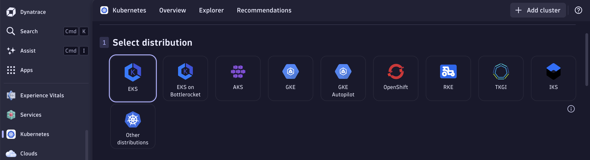
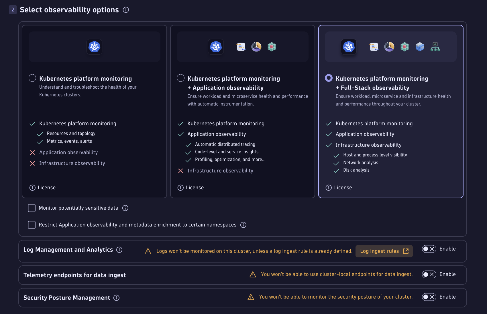
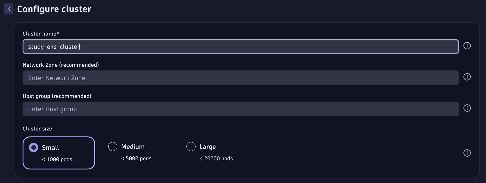
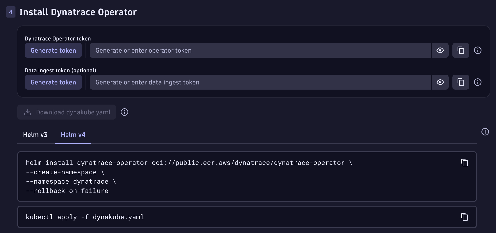
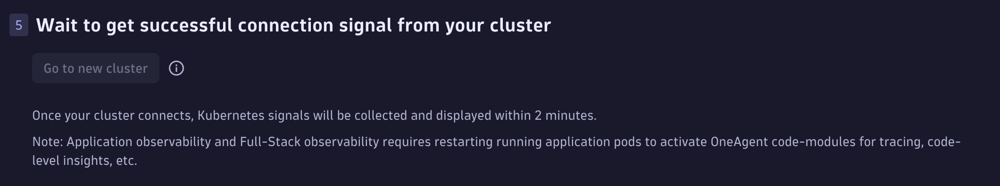

# Dynatrace Monitoring on AWS EKS

This repository documents the steps to install and configure the **Dynatrace Operator** and **OneAgent** to monitor workloads and nodes in an AWS EKS cluster.

---

## 🚀 Prerequisites
- An active [Dynatrace environment](https://www.dynatrace.com/).
- Access to your AWS EKS cluster (`kubectl` configured).
- Helm installed locally.

---

## 📝 Setup Steps

### 1. Log in to Dynatrace

- Navigate to **Kubernetes** in the Dynatrace UI.
- Click **Add cluster**.
- Choose **EKS**.

---

### 2. Select Observability Options


Enable:
- Kubernetes platform monitoring  
- Full-stack observability  
  - Application observability  
  - Infrastructure observability  
  - Host and process level visibility  
  - Network analysis  
  - Disk analysis  

Disable if not required:
- Log Management and Analytics  
- Telemetry endpoints for data ingest  
- Security Posture Management  
---

### 3. Configure Cluster


- Provide **Cluster name**.  
- Specify **Cluster size**.

---

### 4. Install Dynatrace Operator


Generate required tokens:
- **Dynatrace Operator token** (mandatory).  
- **Data ingest token** (optional).  

Download the customized `dynakube.yaml` file generated by Dynatrace.

Install the operator:
```bash
helm install dynatrace-operator oci://public.ecr.aws/dynatrace/dynatrace-operator \
  --create-namespace \
  --namespace dynatrace \
  --rollback-on-failure
```

```bash
kubectl apply -f dynakube.yaml
```
---

### 5. Wait to get successful connection signal from your cluster.


---

## ✅ Notes
- Adjust observability options based on your monitoring needs.

- If AppArmor is not supported on your EKS nodes, remove or comment out the /sys/kernel/security/apparmor hostPath in dynakube.yaml.

- Security Posture Management (KSPM) is optional; disable if you only need performance monitoring.